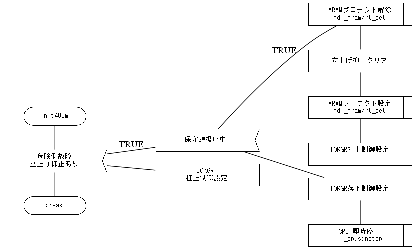

# python-flowChart

**version a1 (alpha 1)**

Python program for creating flowchart from source code. Program was developed with purpose to sync source code with documentation for work purpose.

This program uses reference comments inside source code to generate flow chart.

## To do
Current version is alpha version. Program does the job, but input and output are still rough. I will change program gradually. Please see <a href="https://github.com/jernejp21/python-flowChart/milestones">milestones</a> for improvements.

**When (if) number of users start increasing, I will change milestones, commit comments and issues to English. For now, I will be using Slovene.**

## How to use
### What do I need?
To use this python program, you will need the following SW packages:
- <a href="https://graphviz.org/">Graphviz</a> (I'm using Windows 10 for development and test)
- Python (I'm using <a href="https://www.anaconda.com/distribution/">Anaconda Python</a> 3.7 for development and test)
- Pthon packages:
  - <a href="https://graphviz.readthedocs.io/en/latest/index.html">graphviz</a>
  - <a href="https://pypi.org/project/jaconv/">jaconv</a> (if you use Japanese comments)

### How to use?
- Clone or download repository.
- Put reference comments in your source code (see chapter **Reference comments**)
- Open *flowchar.py* with you favourite text editor:
    - If you don't use Japanese characters, comment *import jaconv*
    - Change *filePath* To path where your source code file is located.
- Save *flowchart.py* and run it: `python flowchart.py`
- Generated files will be saved in the same folder as *flowchart.py* is located.

#### Warning
- Code was tested on embedded C source code.
- Program uses **graphviz** for generating flow chart diagram. 
- Currently program generates correct flow of data, but alignment is sometimes hard to read (will try to fix this).
- Currently program generates only PDF file. "Paper size" is as big as it needs to be (will try to fix this).

# Daido graph

*Daido graph* if one sort of flow chart diagrams. Name *Daido* is based on company I worked for where I started developing this program. The company used this style of flow chart.

These are elements representing the diagram:
- Start and stop of function
  <br>
  
- Process
  <br>
  
- If branch
  <br>
  
- For loop (in the future any loop)
  <br>
  
- Sub function
  <br>
  
- Sub routine
  <br>
  
- Middleware
  <br>
  


# Reference comments

Reference comments are used to create flow chart diagram based on source code. To generate proper diagram, the following syntax of reference comment must be used.

`fc:<block_name> string_without_space "string with space"`

For `<block_name>` use one of the comments from **List of reference comments**.
<br>
After `<block_name>` you can place two strings. If string is separated with space, it will be moved to new line in diagram block. To avoid that, use **"** for strings with space.

### Examples:

`fc:<block_name> short string` will be displayed as

|short |
|------|
|string|

`fc:<block_name> "short string"` will be displayed as

|short string|
|------|
||

`fc:<block_name> string` will be displayed as

|string|
|------|
||

`fc:<block_name> "upper level" "lower level"` will be displayed as

|upper level |
|------------|
|lower level |

There is also a limit how many strings can go into 1 row. The limit is 24 half-width characters or 12 full-width characters. Actually, you can input more, but text will go out of borders.
<br>
>this is half-width
><br>
>ｔｈｉｓ　ｉｓ　ｆｕｌｌ−ｗｉｄｔｈ
><br>
>ﾊﾝｶｸ
><br>
>全角


## List of reference comments

Currently supported are the following comments:
- fc:startStop
- fc:process
- fc:ifBranch
- fc:else
- fc:forLoop
- fc:end
- fc:subFunc
- fc:subRoutine
- fc:middleware

## How to use reference comments


### fc:startStop

This comment represents start and stop of the function.

```c
void func(){  //fc:startStop func
...
...
}  //fc:startStop return
```

### fc:process

This comment represents process line of code.

```c
int a = 5;  //fc:process "init var a" "with 5"

some_var = new_val;  //fc:process "append new_val" "to some_var"
```

### fc:ifBranch

This comment represents beginning of **if** sentence.

```c
if(a > 5){  //fc:ifBranch "is a > 5 ?"
  ...
}
```

### fc:else

This comment represents beginning of **else** part of **if** sentence.

```c
if(a > 5){  //fc:ifBranch "is a > 5 ?"
  ...
}
else{  //fc:else
  ...
}  //fc:end
```


### fc:forLoop

This comment represents beginning of **for** loop. It can be also used for other loops.
<br>
Name will change in the future to "loop".

```c
for(int i = 0; i < 10; i++){  //fc:forLoop "loop 10 times"
  ...
}  //fc:end
```

### fc:end

This comment represents end of **if** sentence and end of **for** loop. It can be also used for other loops.
<br>
Always place **fc:end** at the end of *loops* and *ifs*.

```c
for(int i = 0; i < 10; i++){  //fc:forLoop "loop 10 times"
  ...
}  //fc:end
```

### fc:subFunc

This comment represents call of a sub function. It is based on user's code and opinion to decide which function is main an which is sub.

```c
void func(){
  int a = 5;
  longCode();  //fc:subFunc long_code longCode()
  a = 3;
}
```

### fc:subRoutine

This comment represents call of a sub routine. It is based on user's code and opinion to decide which function is sub routine.

```c
void func(){
  int a = 5;
  executeRepetitiveCode();  //fc:subFunc repetitive_code executeRepetitiveCode()
  a = 3;
}
```

### fc:middleware

This comment represents call of a middleware function. It is based on user's code and opinion to decide which function is middleware.

```c
void func(){
  int a = 5;
  a = myMiddleware();  //fc:subFunc middleware myMiddleware()
}
```

# Example

### Source code

```c
static void init400m(void){//fc:startStop init400m
  /***	ローカル変数		***/
	
  /***	処理開始			***/
  if(kpinfwt.rstinf == ON){					/*	fc:ifBranch 危険側故障　立上げ抑止あり */
      if((systeminwt.sysin_fix & MAINTE_SW) == MAINTE_SW){
                                            /*	fc:ifBranch 保守SW扱い中? */
          mdl_mramprt_reset(TSK_INIT, CID_79, (UH *)&kpinfwt.rstinf);
                                            /*	fc:middleware MRAMプロテクト解除 mdl_mramprt_set */
          kpinfwt.rstinf = OFF;				/*	fc:process 立上げ抑止クリア */
          mdl_mramprt_set(TSK_INIT, CID_78, (UH *)&kpinfwt.rstinf);
                                            /*	fc:middleware MRAMプロテクト設定 mdl_mramprt_set */
          systemoutwt.iokgr_ctl = ON;			/*	fc:process IOKGR扛上制御設定 */
      }else{//fc:else
          systemoutwt.iokgr_ctl = OFF;		/*	fc:process IOKGR落下制御設定 */
          l_cpusdnstop(TSK_INIT, ERRID_CM_N17, NULL, 0u, RSTCTLON);
                                            /*	fc:middleware "CPU 即時停止" l_cpusdnstop */
      }//fc:end
  }else{//fc:else
      systemoutwt.iokgr_ctl = ON;				/*	fc:process IOKGR "扛上制御設定" */
  }//fc:end
}//fc:startStop break
```
### Generated flow chart

